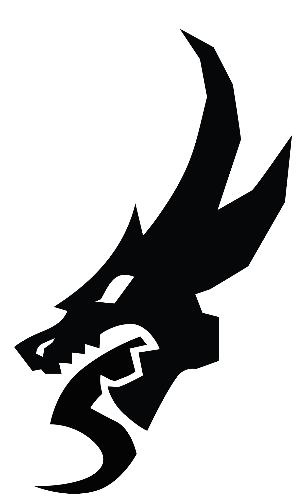

# C++ Programmer

<b>Location: In or near Stockholm. The work will be up to 80% remote  
 Job Type: Temporary employment (Until January 2026, with possibility of extension). Consultant or Employee. </b>

**Job Description**

 Roden Games is seeking a talented and passionate C++ Programmer to join our team as a consultant for Mojang. This is a unique opportunity to work with one of the most influential game developers in the industry. We are looking for someone with experience, but if your title would be mid or senior is not crucial. We are looking for the right fit.

**Responsibilities**

* Implementing online, social and multiplayer systems for the game client. 
* Make use of third-party networking API:s and services to deliver a smooth and coherent experience on all our target platforms.  
* Together with Game Designers, develop and improve features to ensure a great multi-player experience. 
* Supporting and aligning with other feature teams working on your game project 
* Work closely with backend engineers to help build scalable backend systems that will build the backbone of the social and collaborative aspects of the game experience. 

**Required Qualifications**

* Professional experience with modern C++ (including refactoring, optimization, debugging and testing), and familiarity with recent revisions to the C++ standard.  
* Proficient in working with game engines 
* Experience in distributed systems such as Multiplayer games or similar server-client interaction. 
* Self-motivated and able to work independently as well as in a team  
* Strong communication skills  
* Great interpersonal skills 
* Excellent problem-solving skills and attention to detail. 

**Preferred Qualifications**

* Proficient in at least one modern game engine (e.g., Unreal Engine). 
* Experience with console development across multiple platforms. 
* Hands-on experience implementing multiplayer features in shipped console games. 
* Familiarity with matchmaking, lobbies, friends lists, and host migration. 
* Living in or near Stockholm, with the ability to work from the office at least two days per week. 

**What We Offer**

* An exciting opportunity to work on high-impact projects with Mojang. 
* A collaborative and creative work environment. 
* Competitive compensation. 
* Potential for extension beyond the initial contract period. 
* Flexibility job type, you can join as an employee or consultant.

**How to Apply**

If you are passionate about game development and eager to contribute to innovative and engaging gaming experiences, we'd love to hear from you! Please send your resume and portfolio to jobs@rodengames.com with the subject line "C++ Programmer - [Your Name]". 
 
**About Roden Games**

Roden Games is a small and very well-functioning game development company. Although we prefer to stay behind the scenes, our work speaks for itself through the high-quality gaming experiences we help create. As a trusted partner to industry leaders like Mojang, we pride ourselves on our technical expertise, creative vision and solid work ethic, and having a good time while working. We are committed to fostering a supportive and collaborative work environment where everyone can thrive and achieve their best. 

<!--

<!--  >
<!--

<!-- Add any more sections as needed -->
